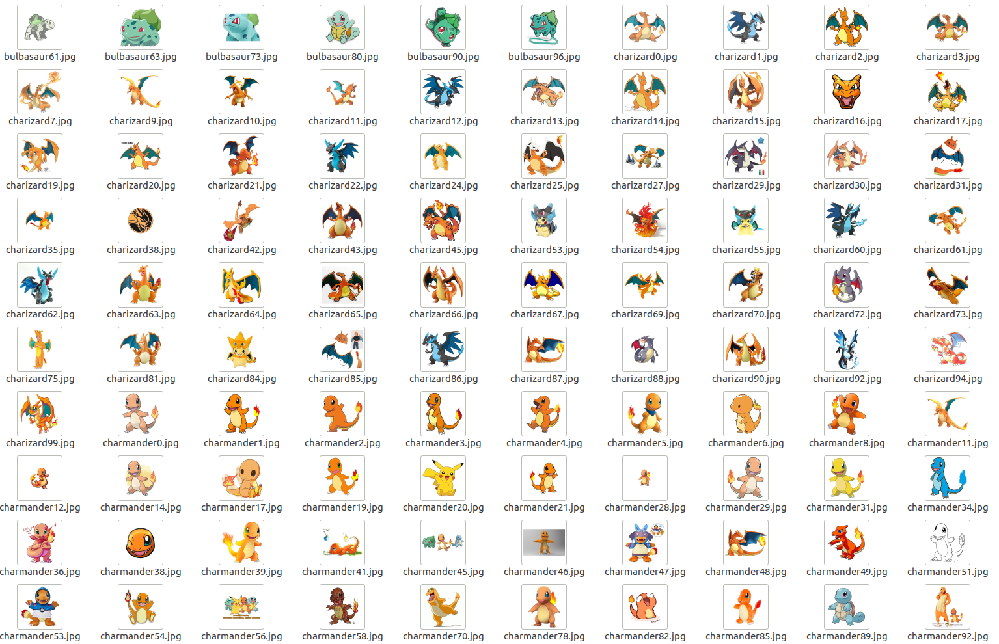

# image_dataset_creator_for_ML
Image Dataset Creator and Normalizer for Machine Learning Projects

# Overview
This is a series of tools to create image datasets for machine learning based on google image search and a pre-trained neural network to discriminate useful or rubbish images.

The tools I created are:
* GoogleImageSpider.py: A wrapper-spider which function is to emulate a browser using google image search in order to download a bunch o images about the same topic
* ImageNormalizer.py: Really useful class to normalize PNG, JPG or GIF of images into a little thumbnails of the size, background and no transparencies images finally saved in a JPG. (Really useful for my ML projects)
* ImageClassifier.py: Last but not least, an CNN implementing an image classifier in order to tag "GOOD" and "BAD" images with two or tree simples lines of code.

# Examples
This is an example of how this works trying to create a pokemon dataset: [Pokemon dataset example](https://github.com/ianholing/image_dataset_creator_for_ML/blob/master/get_them_all.ipynb)

And how the final result will be:

